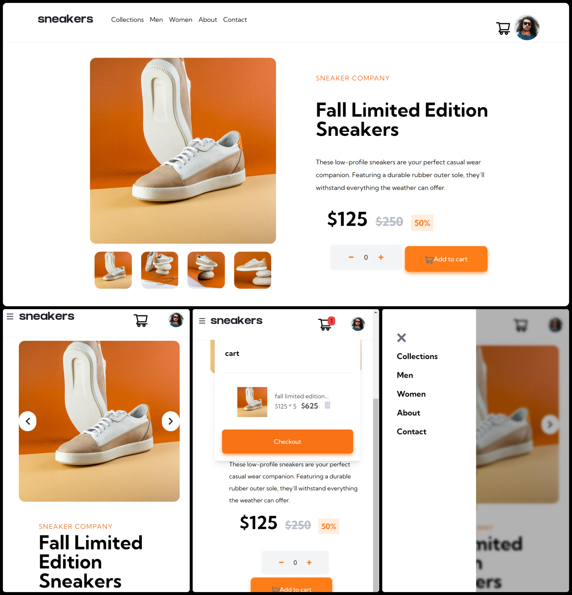
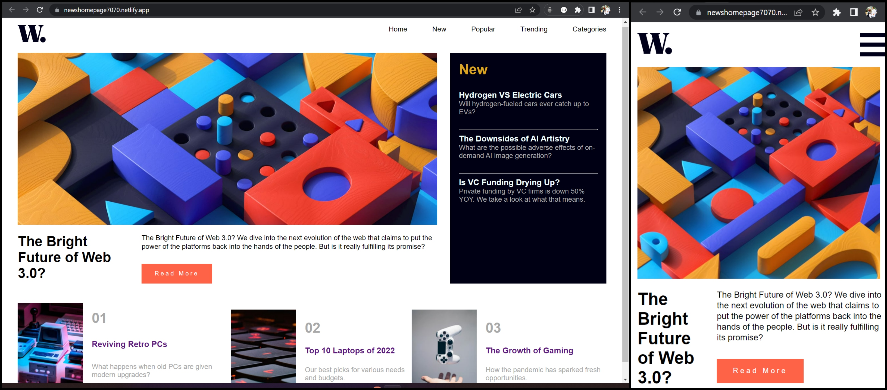
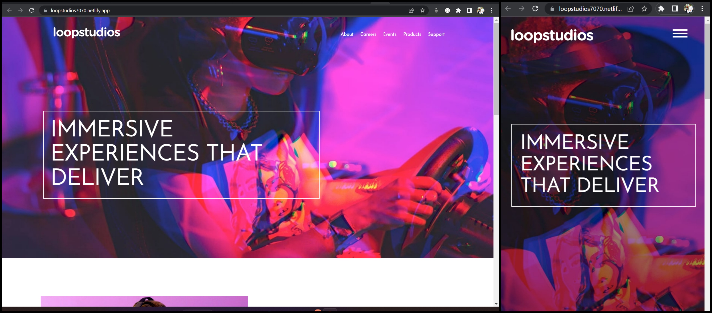
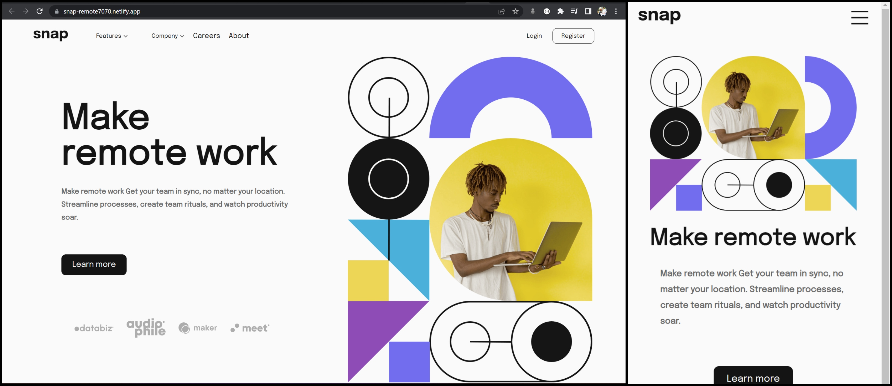
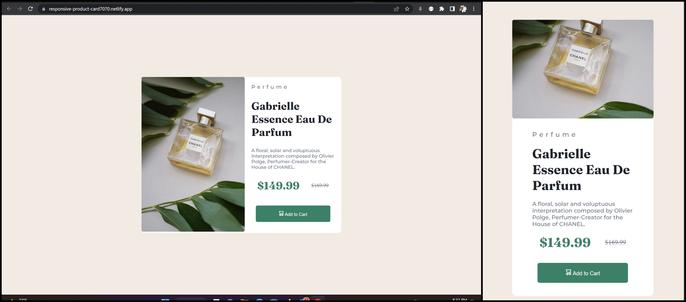
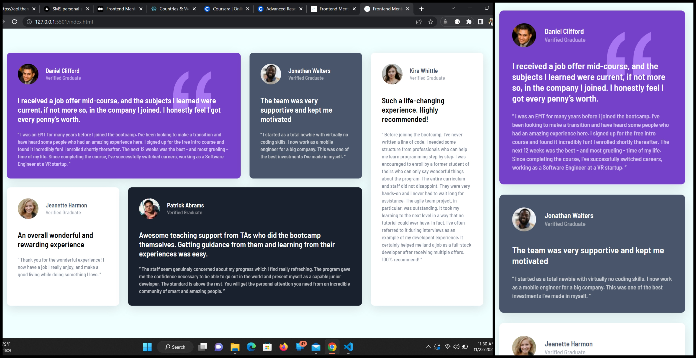

## Frontend-mentor-challanges

### 1.Ecommerce landingPage of sneakers

##### created this app with "React" though this may look like a simple app a lot of things are going inside it like state-management,overlay, carousel etc etc everything built from scrath...

<a href="https://ecommerce-sneakers-home7070.netlify.app/" height="60%" target="_blank" rel="noopener noreferrer">➡️Visit here⬅️ </a>

### 2. Chat illustration master UI with animation

<a href="https://chat-app-illustration7070.netlify.app/" height="60%" target="_blank" rel="noopener noreferrer">➡️Visit here⬅️ </a>

### 3.News Home page

<a href="https://newshomepage7070.netlify.app/" target="_blank" rel="noopener noreferrer">➡️Visit here⬅️ </a>

### 4.Loopstudios-VR landingPage

<a href="https://loopstudios7070.netlify.app/" target="_blank" rel="noopener noreferrer">➡️Visit here⬅️ </a>

### 5.Intro section with dropdown navigation

<a href="https://snap-remote7070.netlify.app/" target="_blank" rel="noopener noreferrer">➡️Visit here⬅️ </a>

## Mini components section

### 6.Responsive-product-card

<a href="https://responsive-product-card7070.netlify.app/" target="_blank" rel="noopener noreferrer">➡️Visit here⬅️ </a>

### 7.testimonials-griddy-review

<a href="https://griddy-review7070.netlify.app/" target="_blank" rel="noopener noreferrer">➡️Visit here⬅️ </a>

